# App Screenshots - Light

Explore the clean dark user interface of **Light - Prayer Reminder**.

---

## Main Prayer Dashboard

The primary screen gives immediate visibility to today's prayer timings, active countdown to the next prayer, and Hijri date information.

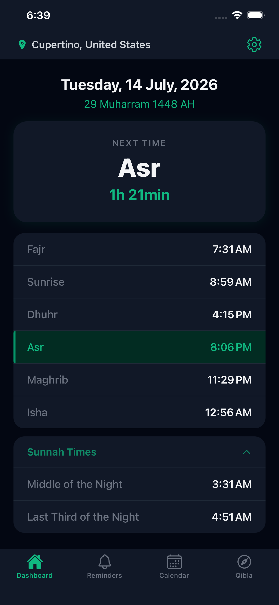

---

## Prayer Reminders Setup

Tailor sound alerts and notification preferences for each prayer individually.

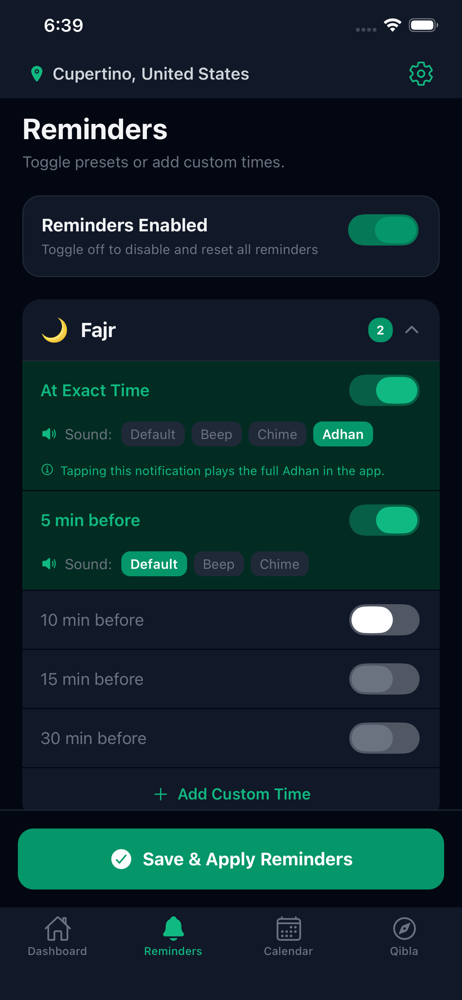
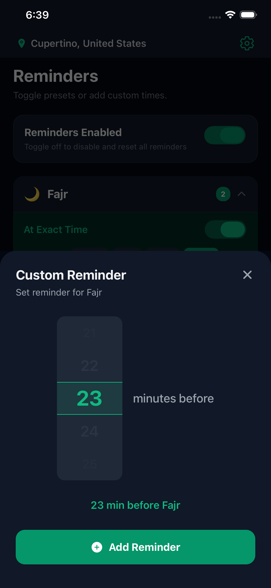

---

## Qibla

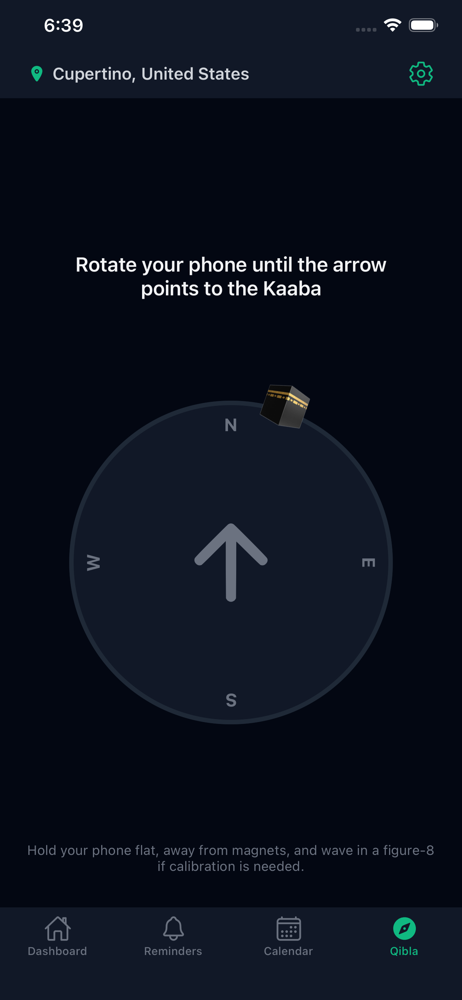

---

## Calendar

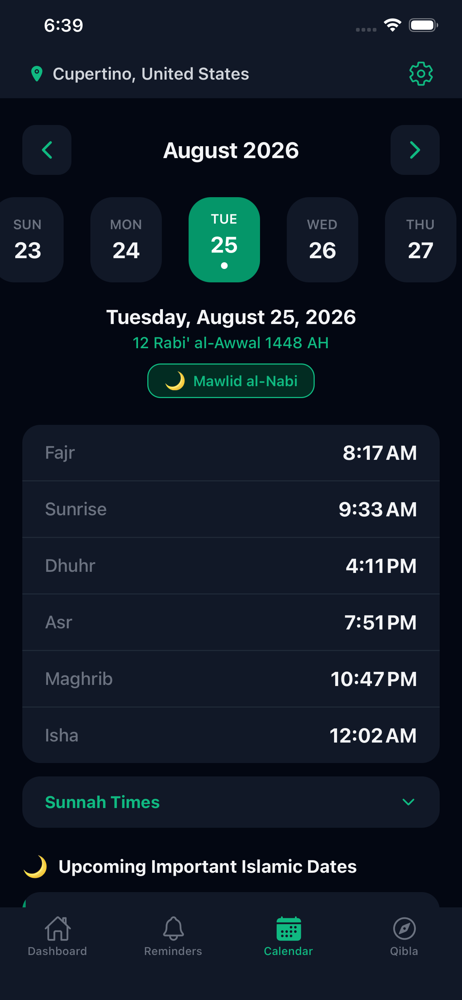
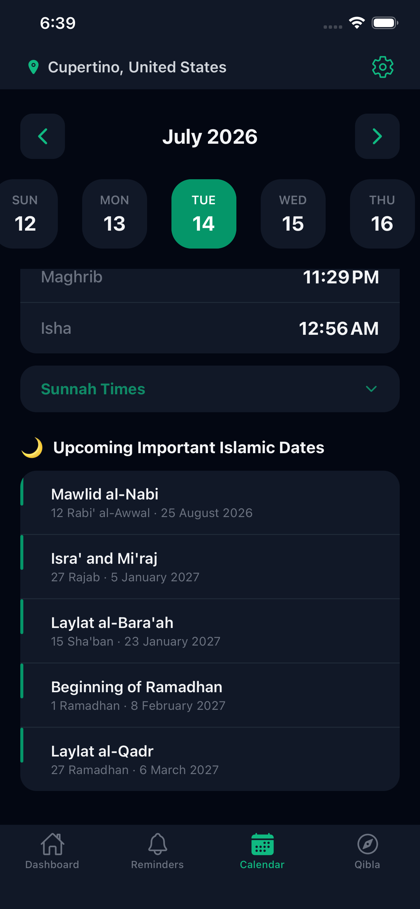

---

## Additional Views

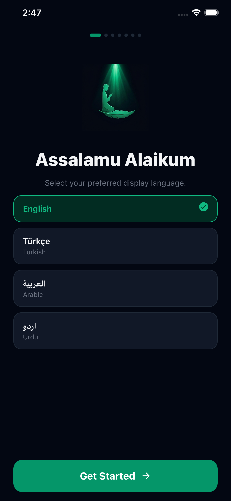
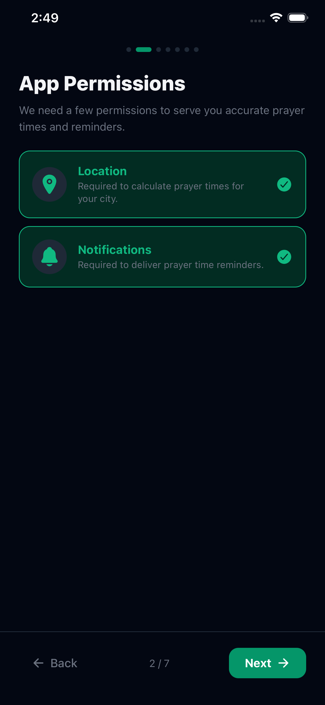
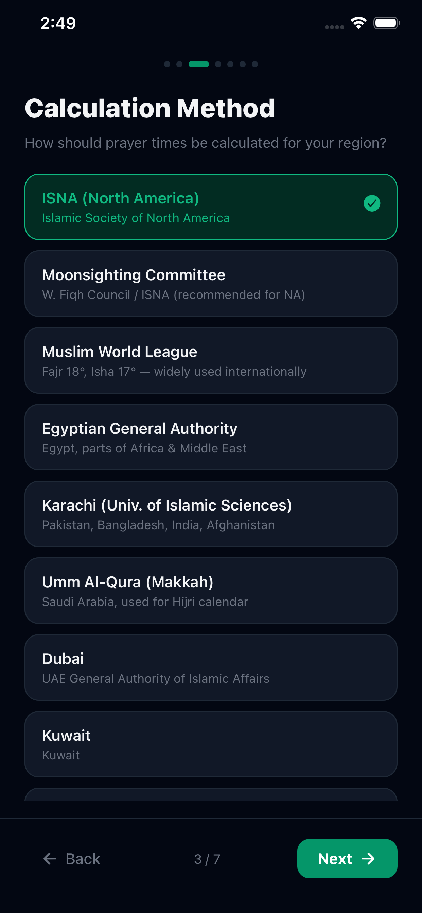
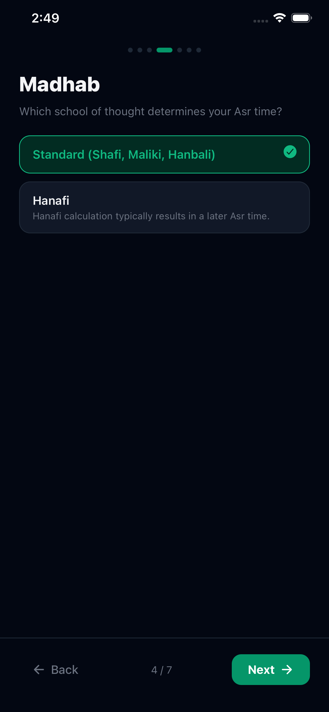
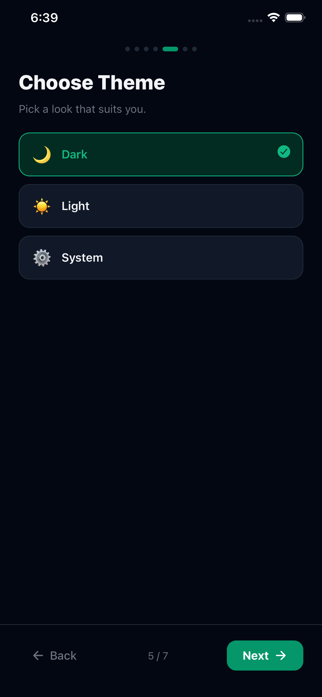
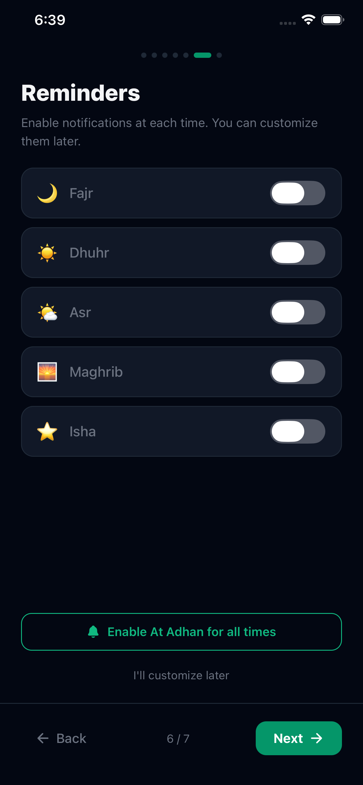

---

[← Back to Homepage](index.md) | [Support Center](support/index.md)
